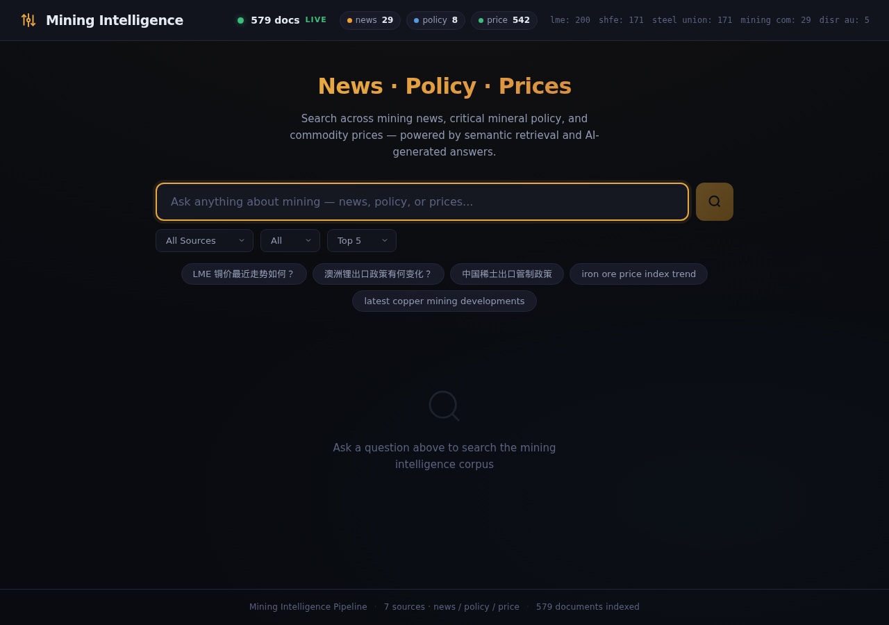
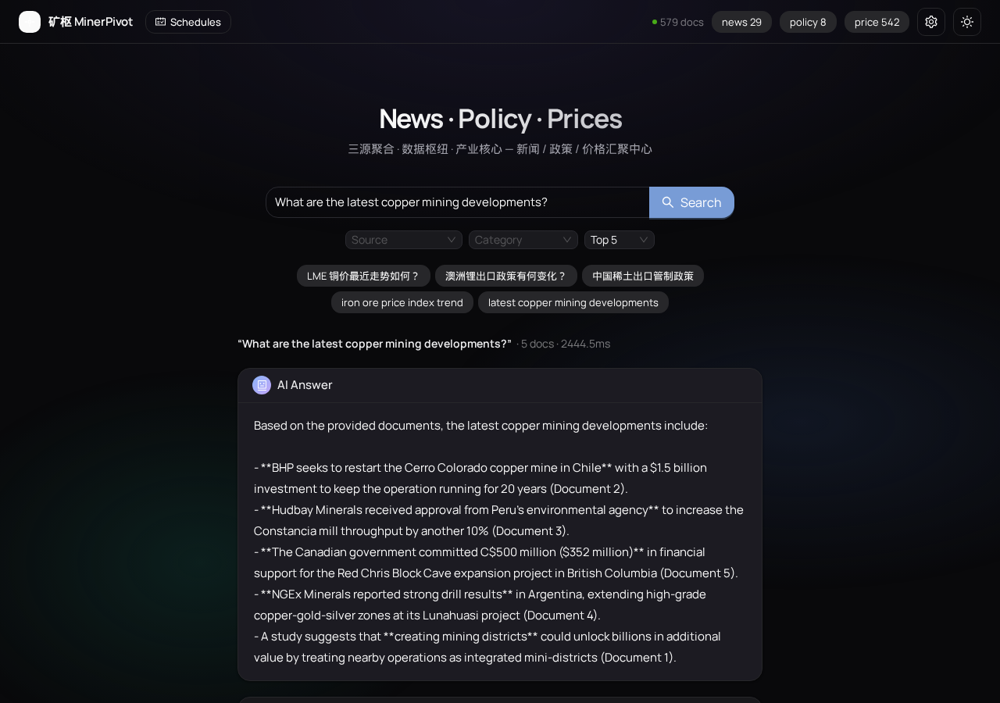
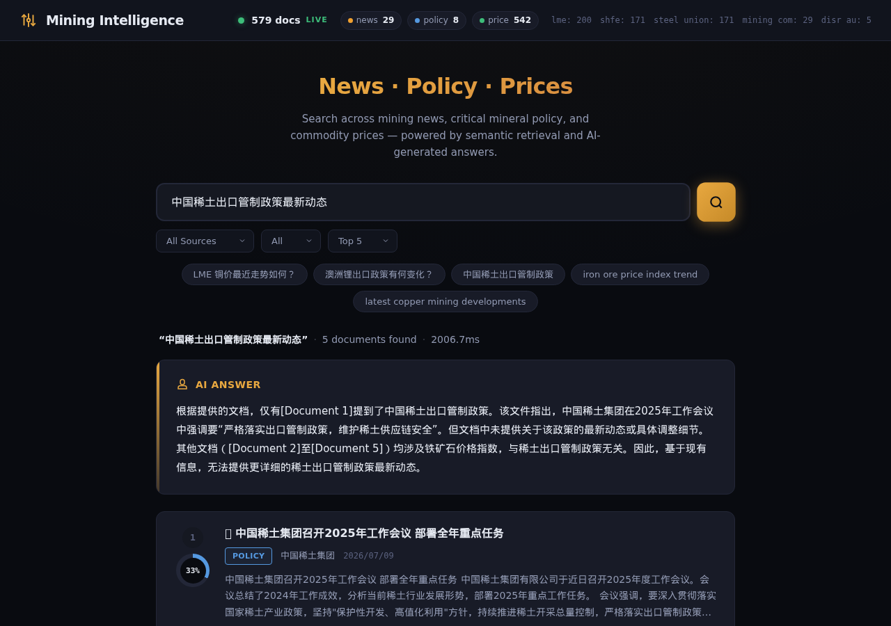
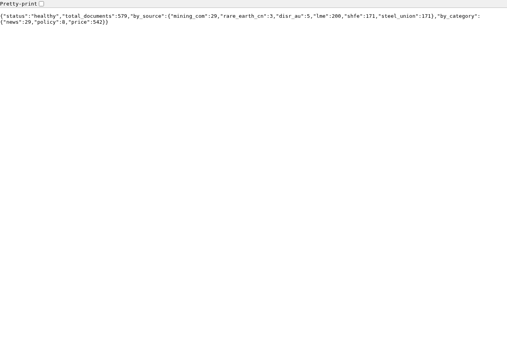

# 🏔️ 矿枢 MinerPivot

> AI-powered semantic search over global mining news, critical mineral policy, and commodity prices — built for the modern mining analyst.

**🔗 Live Demo:** [https://concerned-pharmacy-mine-asia.trycloudflare.com](https://concerned-pharmacy-mine-asia.trycloudflare.com)

---

## 📸 Demo

### Homepage



### English Query — "What are the latest copper mining developments?"



### Chinese Query — "中国稀土出口管制政策最新动态"



### Health API



---

## ✨ What It Does

Ask natural language questions about the global mining industry — in English or Chinese — and get AI-generated answers backed by real data from 7 authoritative sources.

### Example Queries

| Question | Category |
|----------|----------|
| "澳洲锂出口政策有何变化？" | Policy |
| "中国稀土出口管制政策" | Policy |
| "What are the latest copper mining developments?" | News |
| "LME copper price trend and outlook" | Price |
| "SHFE 碳酸锂期货价格近期走势" | Price |

### Live Demo Response

```
Question: What are the latest copper mining developments?

Answer: Based on the provided documents:
- BHP has begun the process to reopen the Cerro Colorado copper mine in Chile,
  targeting a $1.5 billion investment to keep the operation running for 20 years.
- Hudbay Minerals received approval from Peru's government to further increase
  capacity at the Constancia mine...

Retrieved: 3 documents | Query time: 1636ms | Total corpus: 579 docs
```

---

## 🏗 Architecture

```
┌─────────────────────────────────────────────────────────┐
│                    Frontend (React + Vite)               │
│              SearchBar · AnswerCard · ResultCard          │
└──────────────────────┬──────────────────────────────────┘
                       │ POST /query
┌──────────────────────▼──────────────────────────────────┐
│                 FastAPI Server (Python)                   │
│          /health  ·  /query  ·  Static Files             │
└──────┬────────────────────────────────────────┬─────────┘
       │                                        │
┌──────▼──────────┐                    ┌────────▼────────┐
│  LLM (DeepSeek) │                    │  Vector Store   │
│  Answer Gen     │                    │  TF-IDF / BGE-M3│
└─────────────────┘                    └────────┬────────┘
                                                │
┌───────────────────────────────────────────────▼────────┐
│                  Ingestion Pipeline                     │
│  Scrape → Clean → Dedup → Embed → Store                │
└──────┬─────────────────────────────────────────────────┘
       │
┌──────▼──────────────────────────────────────────────────┐
│              7 Data Sources (RSS + HTML)                 │
│  Mining.com · S&P Global · 中国稀土集团 · Australia DISR  │
│  LME · SHFE · 上海钢联 (Mysteel)                         │
└─────────────────────────────────────────────────────────┘
```

---

## 📊 Data Sources

| # | Source | Category | Language | Method |
|---|--------|----------|----------|--------|
| 1 | Mining.com | News | EN | RSS + full-text |
| 2 | S&P Global Mining | News | EN | RSS + full-text |
| 3 | 中国稀土集团 (CREG) | Policy | ZH | HTML scraping |
| 4 | Australia DISR | Policy | EN | HTML scraping |
| 5 | LME | Price | EN | HTML + API |
| 6 | SHFE (碳酸锂) | Price | ZH | HTML + daily data |
| 7 | 上海钢联 (Mysteel) | Price | ZH | HTML + index page |

**Corpus:** 579+ documents · 3 categories · 2 languages

---

## 🛠 Tech Stack

| Layer | Technology |
|-------|-----------|
| Frontend | React 19 · Vite 8 · CSS3 |
| Backend | Python 3.12 · FastAPI · Uvicorn |
| AI/LLM | DeepSeek API (OpenAI-compatible) |
| Embedding | BGE-M3 (1024-dim) / TF-IDF fallback |
| Vector DB | ChromaDB / Lightweight NumPy store |
| Scraping | httpx · BeautifulSoup4 · feedparser |
| Dedup | SHA256 ID · MD5 fingerprint · Jaccard |
| Deployment | Docker · Render · Fly.io · Cloudflare Tunnel |

---

## 🚀 Quick Start

### Prerequisites
- Python 3.10+
- Node.js 22+

### 1. Clone & Install
```bash
git clone https://github.com/zhengjs1225/MinerPivot.git
cd mining-pipeline

# Install Python dependencies
pip install -r requirements.txt

# Install frontend dependencies
cd frontend && npm install && cd ..
```

### 2. Configure
```bash
cp .env.example .env
# Edit .env with your LLM API key:
#   LLM_API_KEY=sk-your-key-here
#   LLM_BASE_URL=https://api.deepseek.com/v1
#   LLM_MODEL=deepseek-chat
```

### 3. Ingest Data
```bash
# Full pipeline (scrape all sources + embed + store)
python -m pipeline.ingest

# Dry run (no DB write, saves sample)
python -m pipeline.ingest --dry-run

# Single source only
python -m pipeline.ingest --source mining_com
```

### 4. Start Server
```bash
# Production mode (serves API + frontend)
FRONTEND_DIR=frontend/dist SERVE_STATIC=true python -m serve.app

# Development mode (API only, run Vite separately for frontend)
python -m serve.app
```

### 5. Open Browser
- Production: `http://localhost:8000`
- Development: API at `http://localhost:8000` + Frontend at `http://localhost:5173`

---

## 📡 API Reference

### `GET /health`
```json
{
  "status": "healthy",
  "total_documents": 579,
  "by_source": { "mining_com": 29, "lme": 200, ... },
  "by_category": { "news": 29, "policy": 8, "price": 542 }
}
```

### `POST /query`
```bash
curl -X POST http://localhost:8000/query \
  -H "Content-Type: application/json" \
  -d '{
    "question": "LME copper price trend",
    "top_k": 5,
    "generate_answer": true,
    "category_filter": "price"
  }'
```

| Parameter | Type | Default | Description |
|-----------|------|---------|-------------|
| `question` | string | (required) | Natural language query (zh/en) |
| `top_k` | int | 5 | Documents to retrieve (1-20) |
| `generate_answer` | bool | true | Generate LLM answer from context |
| `source_filter` | string | null | Filter by source (e.g., `lme`, `disr_au`) |
| `category_filter` | string | null | Filter by category: `news` / `policy` / `price` |
| `days_filter` | int | null | Only docs from last N days |

---

## 📁 Project Structure

```
mining-pipeline/
├── pipeline/                 # Core data pipeline
│   ├── scrapers/            # 7 source scrapers (news/policy/price)
│   ├── cleaner.py           # Text cleaning & normalization
│   ├── dedup.py             # 3-stage deduplication
│   ├── embedder.py          # BGE-M3 embedding generation
│   ├── vector_store.py       # ChromaDB vector store
│   ├── lightweight_store.py  # TF-IDF fallback (zero heavy deps)
│   ├── seed_data.py         # Seed data for unreachable sources
│   ├── config.py            # Configuration & schema
│   └── ingest.py            # Pipeline orchestrator
├── serve/
│   └── app.py               # FastAPI server + static file serving
├── frontend/
│   └── src/
│       ├── App.jsx          # Main application
│       ├── components/      # SearchBar, AnswerCard, ResultCard, StatsBar
│       ├── hooks/           # useQuery custom hook
│       └── lib/             # API client
├── eval/
│   ├── evaluate.py          # Evaluation harness (recall@k + faithfulness)
│   └── ground_truth.py      # 20 bilingual Q&A pairs
├── Dockerfile               # Multi-stage production build
├── render.yaml              # Render Blueprint (one-click deploy)
├── fly.toml                 # Fly.io deployment config
├── run.sh                   # Convenience script
└── DATA_NOTES.md            # Detailed architecture documentation
```

---

## 🧪 Evaluation

20 ground-truth Q&A pairs (10 Chinese + 10 English) across 3 categories:

```bash
# Run evaluation
python -m eval.evaluate --k 5 --verbose

# With faithfulness scoring
python -m eval.evaluate --faithfulness --output results.json
```

| Metric | Description |
|--------|-------------|
| **recall@k** | Fraction of questions where relevant doc appears in top-k |
| **faithfulness** | LLM answer factuality (keyword overlap + LLM judge) |

---

## 🐳 Docker

```bash
docker build -t mining-pipeline .
docker run -p 8000:8000 \
  -e LLM_API_KEY=sk-your-key \
  -e LLM_BASE_URL=https://api.deepseek.com/v1 \
  -e LLM_MODEL=deepseek-chat \
  mining-pipeline
```

---

## 📝 License

MIT

---

🤖 Built with [Claude Code](https://claude.com/claude-code) · DeepSeek · FastAPI · React
